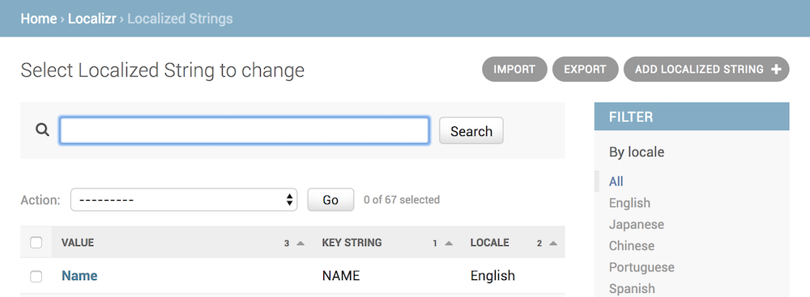
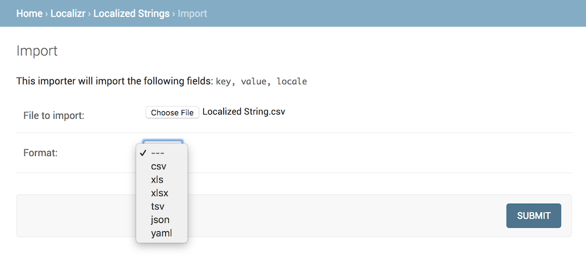
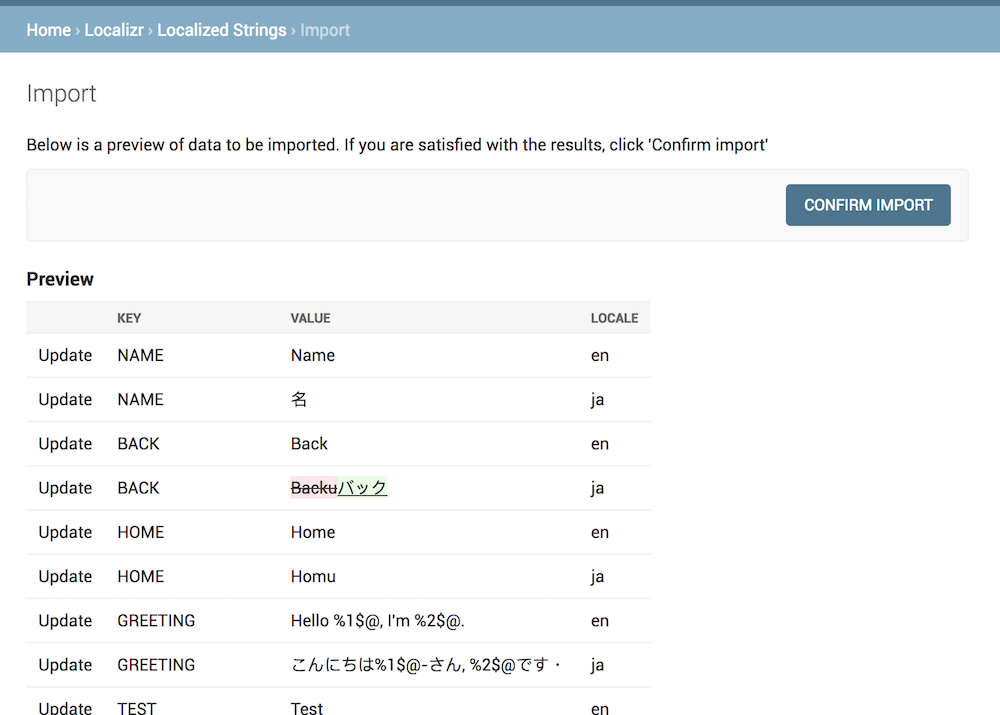

# Localizr

[](https://travis-ci.org/michaelhenry/Localizr)

Localizr is a DSL that handles and automates localization files. Basically we give limited access to the translators to let them input or upload different keystrings and we developer will just fetch it on development or deployment only when if there is an update or changes. This will lessen or prevent the mistake that developer made because he/she has no clue what are those words is and most of them (including me, but not all) are just copy pasting those words (especially when it comes to chinese or japanese characters) from excel to the Localizable.strings via Xcode.
      

## Features
- Multi-App support. reusable keys for different applications.
- Android and IOS support.
- Integrated with `Fastlane actions`. (for IOS, `Fastlane actions localizr`) 
- Default fallback for missing localizations.
- Export and import to different file format.
- Easy deployment: [](https://heroku.com/deploy?template=https://github.com/michaelhenry/localizr)
- Static files hosted in AWS S3 (Optional)


## DEMO
- http://localizr.iamkel.net
You can access the demo pages with this credential:
```
username: demo
password: localizr
```


## IOS Client
I have created a demo IOS App, You can pull it from [LocalizrIOSExample Repository](https://github.com/michaelhenry/LocalizrIOSExample).


## For Developers
### Strings Generator
```
http://{your_server.com}/app/{app_slug}.{locale_code}
```
- http://localizr.iamkel.net/app/demo.en
- http://localizr.iamkel.net/app/demo.ja

### Format
#### iOS
- http://localizr.iamkel.net/app/demo.ja?format=ios

### Android
- http://localizr.iamkel.net/app/demo.ja?format=android

### Sync to your xcode project?
By using `Fastlane`. Currently `localizr` action is not officially available in `fastlane` repo, so you have to manually grab it from here  [fastlane/actions](/fastlane/actions) and paste the `actions` folder directly to your project 's `fastlane` folder in order to make this available to your local.
here is the shortcut:
```bash
# from your workplace root folder:
$ curl -o fastlane/actions/localizr.rb https://raw.githubusercontent.com/michaelhenry/Localizr/master/fastlane/actions/localizr.rb
```

```bash
$ fastlane actions localizr
```


and configure it from your `Fastfile`
```ruby
desc "Submit build to fabric."
lane :alpha do
  increment_build_number
  ...
  localizr(
    localizr_server: 'http://your_localizr_server',
    localizr_api_token: 'your-auth-token-from-admin-page',
    locale_codes:  'en,ja,pt,zh,es',
    localizr_app_slug: 'your-app-slug',
    lproj_target_path: 'your-project-folder-name/'
  )
  ...
  gym
  crashlytics
end
```

### S3 Configuration
This is optional, but you can enable this by providing valid information for the following in the environment variables.
```bash
export AWS_ACCESS_KEY_ID='Your aws access key id'
export AWS_SECRET_ACCESS_KEY='Your secret key'
export AWS_STORAGE_BUCKET_NAME='Name of the bucket'
```

## For Non-Developers
### How to use Localizr?

1. Create different `Locales` set the `name` and the `code`.
2. Create an `App` and set the `base_locale` if you want to have a fallback for missing `localized strings`.
3. Create Different `Keys`.
4. Match the `Keys` with the `App` so you can re-use the keys to other apps too.
5. Finally, populate the `localized strings` .


#### Does it look difficult? 
### Then try to use the importer (csv, xls, xlsx, tsv, json, yaml).
You can find the sample csv files in the [sample_data](/sample_data) folder.

1. Import the `Locales.csv` to `Locales` section.
2. Import the `Apps.csv` to `Apps` section.
3. Import the `App's Keys.csv` to `App 's Keys` section.
4. Import the `Localized String.csv` to `Localized String` section.








### How about exporting?
Just find the `EXPORT` button, select the `format` and that's it.


## Recommendation, Automation and Deployment:
With using `CI` and `Fastlane`, create a script or use `fastlane actions localizr` to download and update all the localization strings before `gym` method, So we can always make sure that all strings are updated. 


## TODO:

- [x] iOS format support
- [x] Android format support
- [x] Import/Export contents via CSV file
- [x] CI
- [x] Test cases
- [ ] Interactive UI.
- [ ] Able to use google translate for some missing translations.
- [ ] Docker container support.

## Author

Michael Henry Pantaleon, me@iamkel.net

## License

Localizr is available under the MIT license. See the LICENSE file for more info.
